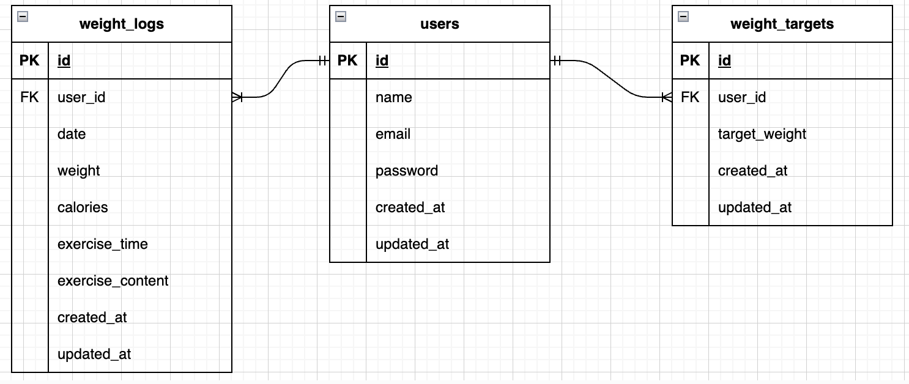

# アプリケーション名
○○アプリ

## 環境構築
1. git clone <リポジトリURL>
2. docker compose up -d --build
3. docker compose exec php bash
4. composer install
5. php artisan key:generate
6. php artisan migrate --seed

## 使用技術
- PHP 8.x
- Laravel 10.x
- MySQL 8.x
- Docker

## ER図

## URL
- ログインページ: http://localhost/login
- 会員登録ページ:
  - Step1: http://localhost/register/step1
  - Step2: http://localhost/register/step2
- 体重管理画面ページ: http://localhost/weight_logs

## テストアカウント
- メールアドレス: test@example.com
- パスワード: password123
- ログイン後、体重管理画面でファクトリの仮データが確認できます